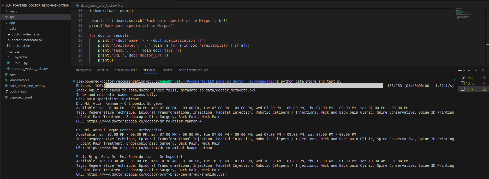
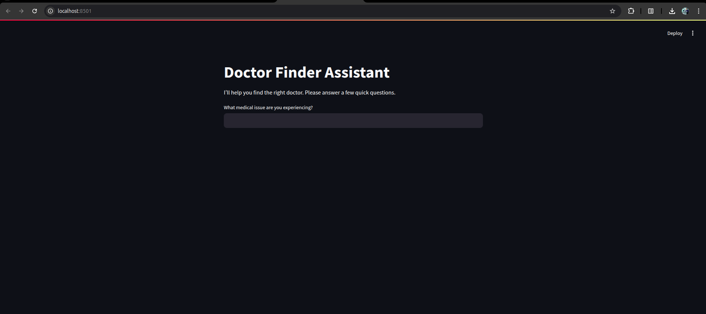
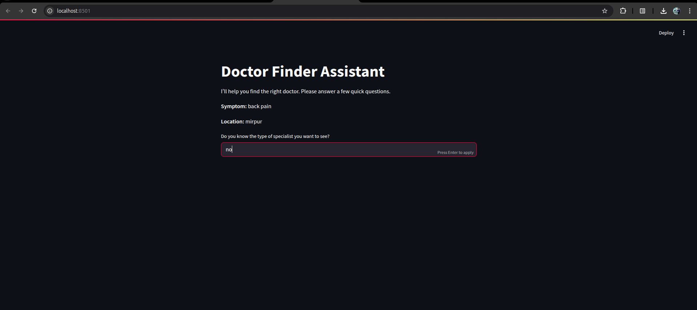
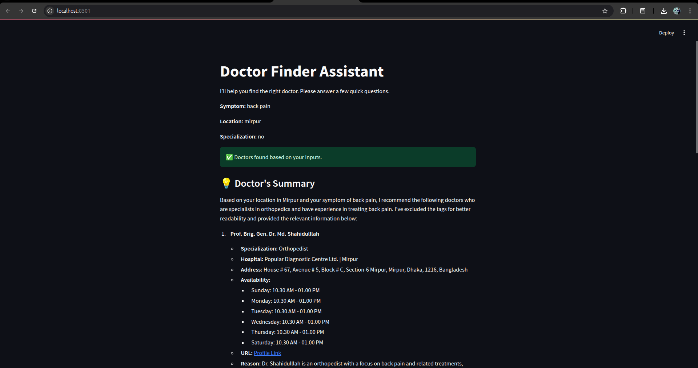
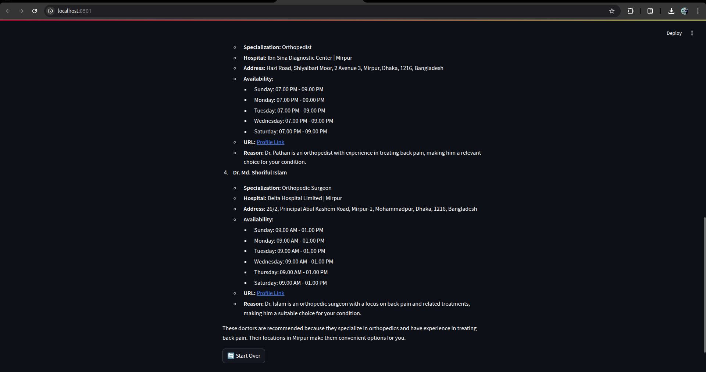

# Check the FAISS Data
### To store the data in FAISS and check if we can search the data perfectly.
```bash
python data_store_and_test.py
```


# Streamlit Frontend Workflow






# Project Setup and Run Instructions

This guide provides steps to set up and run the project, which includes a FastAPI backend and a Streamlit frontend.

## Prerequisites
- Python 3.12
- Poetry (package manager)
- Git for cloning the repository

## Setup Instructions

### 1. Install Poetry (If not installed in your system - skip this if you already installed)
##### Install Poetry using `pip`:

#### On macOS/Linux/Windows:
```bash
pip install poetry
```

Verify Poetry installation:
```bash
poetry --version
```

### 2. Install Dependencies
Open the project directory and install the project dependencies using Poetry:
```bash
poetry install
```

### 3. Activate the Poetry Virtual Environment
Activate the virtual environment to use the installed dependencies:
```bash
poetry shell
```

### 4. Configure Environment Variables
Create a `.env` file in the project root directory and add the environment variable given in .env.example file:
```
DATASET_PATH="data/doctors.json"
VECTOR_DATA_PATH="data/doctor_index.faiss"
METADATA_PATH="data/doctor_metadata.pkl"

LLM_API_KEY="" #api key
```
Replace `your_mistral_api_key_here` with your actual Mistral API key.

### 5. Run the Applications
The project consists of a FastAPI backend and a Streamlit frontend. Run both applications in separate terminal sessions.

#### Run the FastAPI Backend
In one terminal, start the FastAPI server with Uvicorn:
```bash
uvicorn api.main:app --reload
```
The backend will be available at `http://localhost:8000`.

#### Run the Streamlit Frontend
In another terminal, start the Streamlit app:
```bash
streamlit run app/app.py
```
The frontend will be available at `http://localhost:8501`.

## Notes
- Ensure the `.env` file is correctly configured before running the applications.
- The `--reload` flag for Uvicorn enables auto-reload during development.
- Keep both terminals active to run the backend and frontend simultaneously.